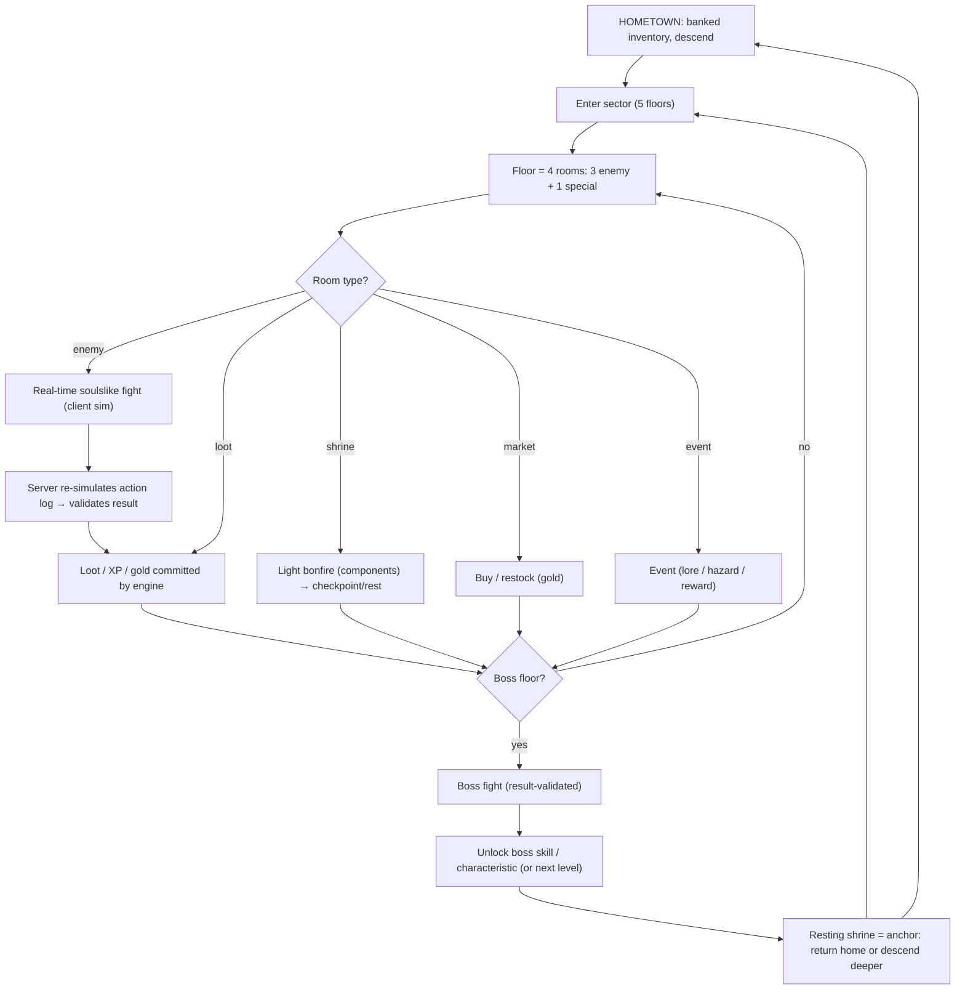

# Game Design Document

> Status: **skeleton** — seeded in T1.1; full content lands across the waves (see `specs/tasks.md`). This file is covered by the `docs:check` drift gate.

Vision, design pillars, core loop, player fantasy, scope (MVP: 3 classes, 10 enemies, 3 bosses), OUT list

## Diagrams

### D2 — Core game loop (macro)

<!-- content to follow -->