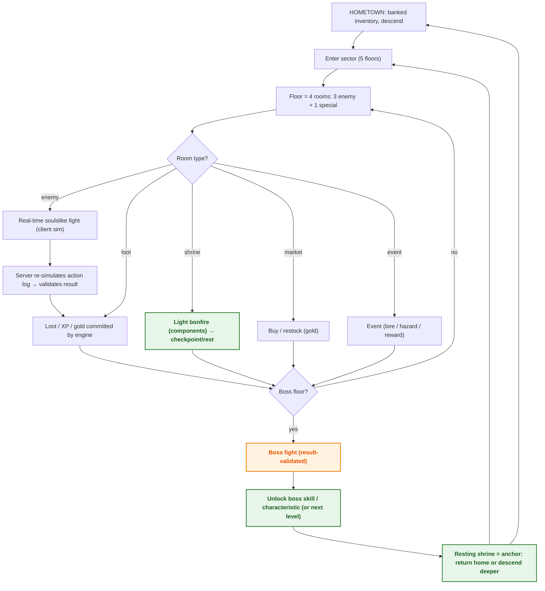

# Game Design Document

> Status: **in progress** — theme, classes, and bosses defined; enemies + balance land in T2.2/T4.1.

Vision: a soulslike roguelike in a **gothic-horror** dungeon (Bloodborne / Castlevania). Shrine-bonfires are the last light against the dark; the deeper you descend, the more the dungeon reflects your own sins back at you.

## Theme

Gothic horror. Three classes descend to survive; three bosses wait below, each a mirror of a class's inner sin.

## Player classes

All classes can equip **any armor** and **any weapon** — the class is a playstyle, not a gear restriction.

### 1. Brawler — the mountain of fists

A harsh-constitution flesh mountain. Years of loading coal and drinking your way out of every decent establishment left you with nothing but hunger, empty pockets, and fists like bricks. The dungeon is a fast way to make coins so you don't sleep in the alleys tonight.

- **Special — Tackle / Suplex**: run at an enemy to shove them backward — into an obstacle (wall/edge) they take impact damage and are **stunned**; enemies that rush you can be **suplexed** overhead into fall damage or an obstacle.
- **Natural traits**: extra stamina, higher carry weight, higher damage resistance.

### 2. Hunter — the woodsman far from home

You used to be happy in the woods, living on what you could hunt and find. But the dungeon changed everything: the quiet town is now a crowded city, the merchants want "goodies" from the cursed deep, and there are mouths to feed. The woods don't provide enough anymore — no choice but to be one of the fools.

- **Special — Impairing traps**: set snares that pin enemies in place while you attack from afar.
- **Natural traits**: precise shots (mechanical crits against pinned/immobile enemies — dice-free, per SC1a), projectile recovery.

### 3. Alchemist — the hungry scholar

You bow to the merchant pigs who treat the dungeon as an infinite bazaar, but you understand it is an infinite source of knowledge. If only you were strong enough, brave enough…

- **Special — Brews + Essence**: brews induce frenzy (temporary stat surge); you extract more resources and **essences** from dead enemies. With enough essence of a given enemy, you can **build one as an ally** — it fights for you until defeated or you return home.
- **Natural traits**: resource extraction, crafting.

## Bosses

Each boss is a **reflection of a class's sin** — a torment that makes the player ask who the real monster is.

### 1. The Violence — Brawler's sin (floor 5)

A hulking, revolting monster that showcases the best of the Brawler's toolkit — it tackles, shoves, and suplexes. A mirror of the violence inside you.

### 2. The Cunning — Hunter's sin (floor 10)

A mischievous creature that **never moves**, **rejects projectiles**, and litters the floor with traps. You must dodge the traps to find a spot to attack — it preys on your fear of progress.

### 3. The Unknown — Alchemist's sin (floor 15)

The opposite of hunger for knowledge: a floating ghost-mass that violates every combat rule. Get too close and it **stomps**; stay too far and it fires **fast projectiles**; hit it and it **heals**; do nothing and it **loses health until it dissolves**.

> **Diagram legend** — 🟠 critical/gate · 🟢 checkpoint/reward · 🔴 terminal/failure · 🔵 info

## Diagrams

### D2 — Core game loop (macro)

## See also

- [Specification (goals + user stories)](../specs/spec.md#2-goals--non-goals)
- [System architecture (D1)](02-architecture.md)
- [Combat state machine (D7)](04-game-states.md)
- [Floor template & pacing (D10)](08-content-catalog.md)

<!-- content to follow -->
