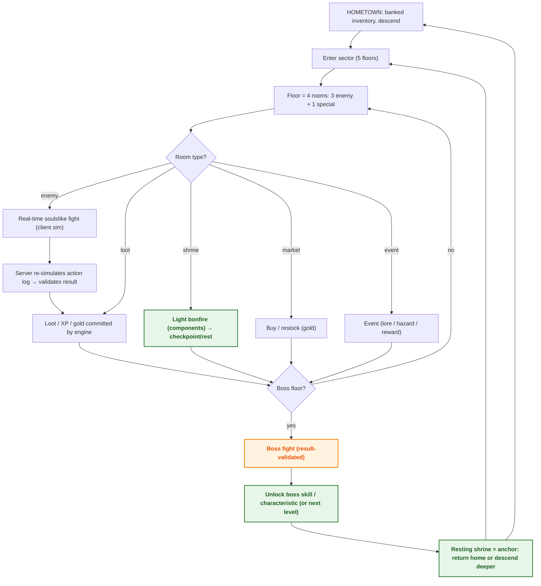

# Game Design Document

> Status: **skeleton** — seeded in T1.1; full content lands across the waves (see `specs/tasks.md`). This file is covered by the `docs:check` drift gate.

Vision, design pillars, core loop, player fantasy, scope (MVP: 3 classes, 10 enemies, 3 bosses), OUT list

> **Diagram legend** — 🟠 critical/gate · 🟢 checkpoint/reward · 🔴 terminal/failure · 🔵 info

## Diagrams

### D2 — Core game loop (macro)

## See also

- [Specification (goals + user stories)](../specs/spec.md#2-goals--non-goals)
- [System architecture (D1)](02-architecture.md)
- [Combat state machine (D7)](04-game-states.md)
- [Floor template & pacing (D10)](08-content-catalog.md)

<!-- content to follow -->
