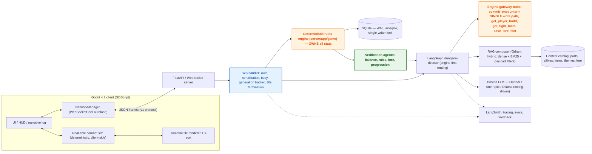
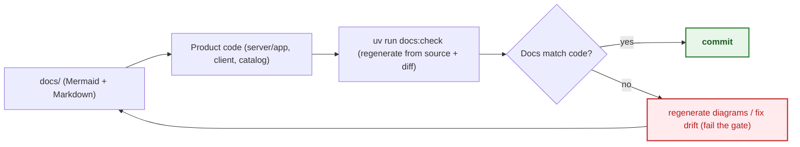

# System architecture

> Status: **skeleton** — seeded in T1.1; full content lands across the waves (see `specs/tasks.md`). This file is covered by the `docs:check` drift gate.

System architecture (D1), deployment (local-first, docker compose for Qdrant), data flow, living-docs sync (D11)

> **Diagram legend** — 🟠 critical/gate · 🟢 success/verified · 🔴 drift/failure · 🔵 info

## Diagrams

### D1 — System architecture

### D11 — Living-docs sync (constantly updated)

## See also

- [System design — authority model](03-system-design.md)
- [WS v1 protocol](05-protocol.md)
- [Agent design — director graph](07-agent-design.md)
- [Security — threat model](13-security.md)

<!-- content to follow -->
