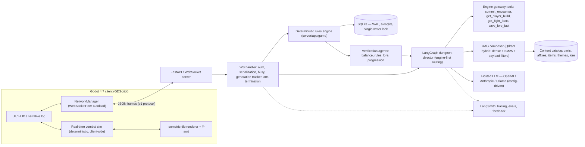
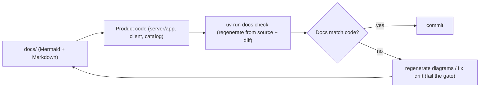

# System architecture

> Status: **skeleton** — seeded in T1.1; full content lands across the waves (see `specs/tasks.md`). This file is covered by the `docs:check` drift gate.

System architecture (D1), deployment (local-first, docker compose for Qdrant), data flow, living-docs sync (D11)

## Diagrams

### D1 — System architecture

### D11 — Living-docs sync (constantly updated)

<!-- content to follow -->