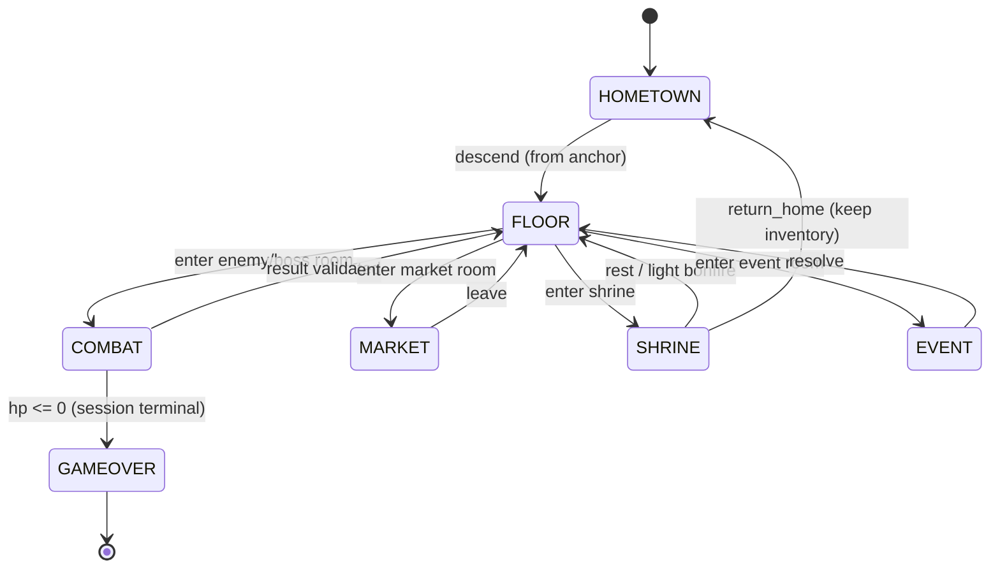

# Game states

> Status: **skeleton** — seeded in T1.1; full content lands across the waves (see `specs/tasks.md`). This file is covered by the `docs:check` drift gate.

State machines: meta (D3), combat/soulslike (D7), floor lifecycle, room types

## Diagrams

### D3 — Meta game-state machine (engine)



### D7 — Soulslike combat state machine (deterministic, client sim + server validate)

```mermaid
stateDiagram-v2
  [*] --> IDLE
  IDLE --> ROLLING: roll (i-frames)
  ROLLING --> IDLE: recovery
  IDLE --> GUARDING: hold shield stance
  GUARDING --> PARRYING: parry (timed window)
  PARRYING --> RIPOSTE: parry success -> posture break
  IDLE --> ATTACKING: attack (input buffered)
  ATTACKING --> IDLE: recovery
  GUARDING --> STAGGERED: posture broken (fatigue)
  IDLE --> STAGGERED: posture 0 (stun)
  STAGGERED --> IDLE: recover
  RIPOSTE --> IDLE: riposte ends
  note right of IDLE: stamina gates every action; regen while IDLE; parry/riposte and posture are seeded-deterministic for replay
```

<!-- content to follow -->