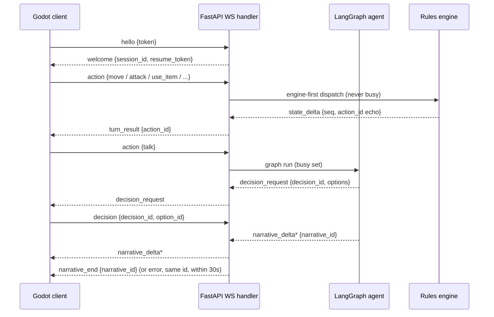
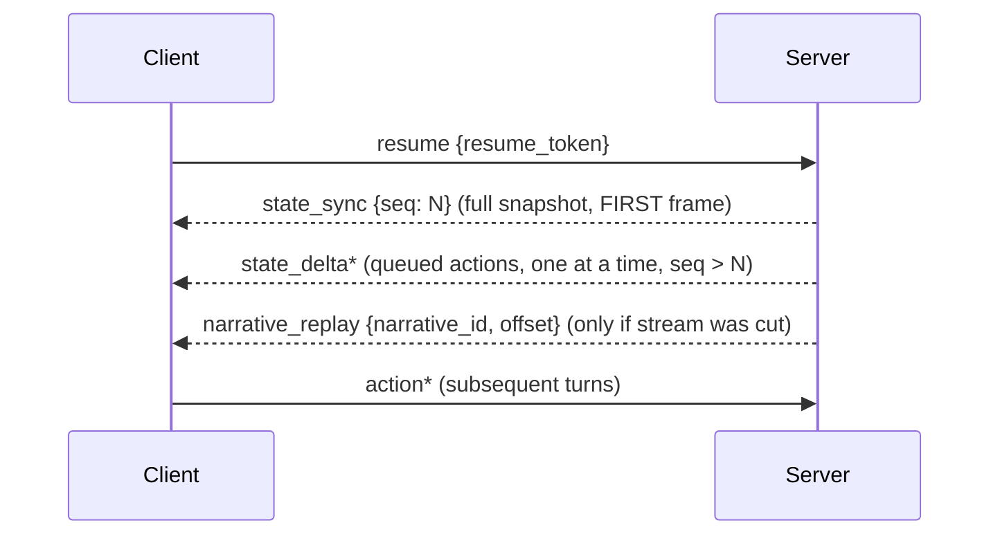

# WS v1 protocol

> Status: **skeleton** — seeded in T1.1; full content lands across the waves (see `specs/tasks.md`). This file is covered by the `docs:check` drift gate.

Message schemas (JSON Schema snippets), sequences (D5a/D5b), error codes, serialization/busy/resume rules

## Diagrams

### D5a — Protocol sequence: normal action + decision + streaming

### D5b — Protocol sequence: resume (pinned order)

<!-- content to follow -->