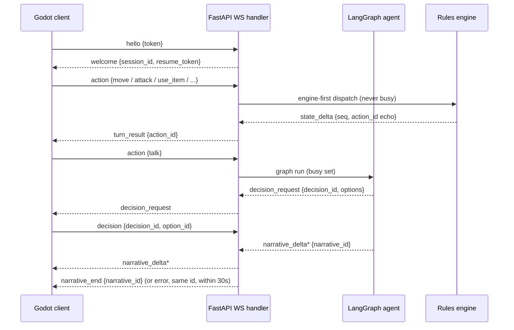
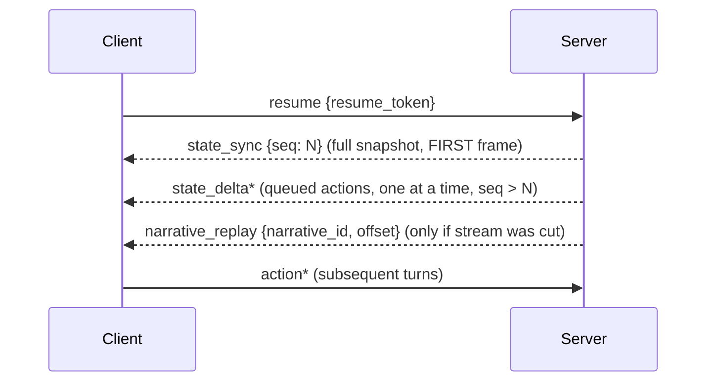

# WS v1 Protocol

> Status: **spec** — authoritative wire contract. Implemented in `server/app/protocol.py`; the Godot mirror lands in T1.4. Conformance-tested in `server/tests/test_protocol.py`.

## 1. Overview & design goals

One persistent WebSocket per session, JSON **text** frames. Goals, in order:

1. **Server authority** — the server owns all state; the client is a thin renderer.
2. **Hardened by default** — per-session HMAC signing, monotonic `seq` anti-replay, strict schemas, rate limits.
3. **Resumable** — a dropped connection resumes to the exact same state deterministically.
4. **B-ready** — tick-stamped fight frames are on the wire from day 1, so flipping to server-authoritative combat is a deployment change, not a protocol change.

## 2. Transport & framing

- WebSocket (WSS/TLS in prod), JSON text frames.
- Max frame **64 KB** (`MAX_FRAME_BYTES`). Oversized → `error {code: frame_too_large}`, connection stays open. `state_sync` is the sole exemption (sent as multiple frames — see §8).
- Malformed JSON (unparseable) → close `1007`. Oversized frame → close `1009` (or `error frame_too_large` when the size is detectable before parse).

## 3. Envelope

Every frame:

```json
{ "v": 1, "type": "action", "id": "a1", "seq": 7, "payload": { }, "hmac": "hex…" }
```

| Field | Type | Meaning |
|-------|------|---------|
| `v` | int | protocol version; `!= 1` → `error unsupported_version` |
| `type` | string | message type (see §5) |
| `id` | string | correlation id; semantics pinned per type (§3.1) |
| `seq` | int ≥ 0 | per-session **monotonic** counter, **per direction**, on every frame |
| `payload` | object | type-specific body |
| `hmac` | string? | hex HMAC-SHA256 (see §10); absent on `hello`/`welcome` only |

### 3.1 `id` semantics (pinned — HMAC covers `id`, so its meaning must be fixed)

| Frames | `id` carries |
|--------|--------------|
| `action`, `turn_result`, `state_delta` | `action_id` (client-generated, echoed back) |
| `narrative_delta`, `narrative_replay`, `narrative_end` | `narrative_id` |
| `fight_input`, `fight_input_ack`, `fight_snapshot`, `fight_submit`, `fight_begin`, `fight_result` | `fight_id` |
| `decision`, `decision_request` | `decision_id` |
| `welcome`, `state_sync` | `session_id` |
| everything else (`ping`/`pong`/`resume`/`error`/`game_over`/`hello`) | monotonic frame id |

### 3.2 `seq` (anti-replay)

Both directions keep an independent `SeqTracker`. A frame with `seq <= last_seen` (that direction) is **rejected** (drop + close `1008` policy violation). Reordering is not allowed: frames are applied in `seq` order.

## 4. Handshake & session lifecycle

1. Client sends `hello` (first message only, unsigned).
2. Server validates the dev token → `welcome {session_id, resume_token, hmac_key}` (unsigned) — or `error auth_failed` + close `1008`.
3. `hmac_key = secrets.token_urlsafe(32)` (≠ session_id). All subsequent frames are HMAC-signed with it.
4. `resume {resume_token}` re-attaches an existing session (see §8). Unknown token → `error session_not_found` (connection stays open; client offers a new game).

## 5. Message catalog

`C2S` = client→server, `S2C` = server→client. All payloads are `extra="forbid"` — unknown fields are rejected.

### 5.1 Client → server

| type | payload (required fields) | notes |
|------|---------------------------|-------|
| `hello` | `{token}` | first message only |
| `action` | `{action, params}` | `action ∈ {move, attack, use_item, rest, return_home, descend, talk, run, shop, equip, drop}` |
| `decision` | `{decision_id, option_id}` | valid only while parked (§6) |
| `fight_input` | `{fight_id, tick, action, params}` | streamed per tick; `tick` monotonic; **records the effective inputs the sim consumed** (input buffering lives in the sim) |
| `fight_submit` | `{fight_id, claimed_result, state_hash, sim_version}` | **no full input log** — the server re-sims the log it already holds |
| `resume` | `{resume_token}` | |
| `ping` | `{}` | heartbeat (§4) |

### 5.2 Server → client

| type | payload (required fields) | notes |
|------|---------------------------|-------|
| `welcome` | `{session_id, resume_token, hmac_key}` | |
| `decision_request` | `{decision_id, prompt, options[{option_id, label}]}` | parks the graph at an interrupt |
| `state_sync` | `{seq, frame_index, frame_total, state}` | full snapshot; first frame after resume; multi-frame (apply on `frame_index == frame_total`) |
| `state_delta` | `{seq, action_id_echo, delta}` | engine diff; client ignores `seq <= baseline` |
| `narrative_delta` | `{narrative_id, text}` | streamed token(s) |
| `narrative_replay` | `{narrative_id, offset}` | only when `narrative_end` was NOT delivered to this client |
| `narrative_end` | `{narrative_id}` | terminal frame for a narrative stream |
| `turn_result` | `{action_id_echo, result}` | |
| `fight_begin` | `{fight_id, seed, sim_version, opponent_spec, room_id}` | |
| `fight_input_ack` | `{fight_id, last_tick}` | acks a batched input group |
| `fight_snapshot` | `{fight_id, tick, state}` | tick-stamped state; the B-ready render-follow frame (rate-capped, ≤64 KB) |
| `fight_result` | `{fight_id, verified, outcome, rewards}` | `verified:false` → server re-syncs |
| `error` | `{code, message, recoverable, narrative_id?}` | |
| `pong` | `{}` | |
| `game_over` | `{reason}` | session `terminal` |

## 6. Serialization & ordering

- **Strict arrival order** per session.
- **`busy` scope**: applies **only** to graph-routed actions (`talk`, ambiguous intents, `decision`). Engine-dispatched typed actions (`move/attack/use_item/rest/return_home/descend/run/shop/equip/drop`) are **never** busy-rejected (at most one-deep queue).
- **Out-of-context `decision`**: while generating → `error busy`; no pending decision → `error rule_violation`.

## 7. Generation lifecycle (termination guarantee)

Every generation terminates with **exactly one** terminal frame — `narrative_end` XOR `error`, same `narrative_id` — within `GENERATION_TIMEOUT` (default **30s**, configurable for tests), on **every** path including fallback. Enforced by the WS handler's per-narrative tracker (`asyncio.timeout`); a hung generation is force-cleared and emits `error generation_failed`.

## 8. Resume & replay (pinned order)

1. `resume` validated → session looked up.
2. `state_sync` as the **first** frame (full snapshot). If larger than 64 KB, split into `N` frames sharing the same `seq` with increasing `frame_index`; the client assembles and applies **only** the final frame (`frame_index == frame_total`).
3. Queued actions applied one at a time, each with its `state_delta`.
4. `narrative_replay` only if a stream was cut (client discards its incomplete buffer first).

## 9. Idempotency & dedup

- Client drops in-flight **unsent** actions older than the `state_sync` baseline.
- Server dedups by `action_id` — bounded set (last 100 per session, cleared on `state_sync`).
- Fight ticks: server appends **idempotently** (ignore `tick <= last`), validates continuity on the merged log at submit.

## 10. Anti-tamper

- **HMAC-SHA256** over `type|id|seq|payload` (payload = `canonical_json`: compact, keys sorted, ascii-escaped). Key from `welcome`. Mismatch → `error hmac_invalid` (connection stays open). `ENABLE_SIGNING` env: ON in tests, OFF in pure-local dev.
- **`seq` anti-replay** (§3.2).
- **Rate limits**: per-session msg/s + per-IP connect limits → `error rate_limited`.
- **WSS/TLS** in prod (deployment config in `docs/13-security.md`; no TLS server in MVP).

## 11. Error codes

`unsupported_version · frame_too_large · rule_violation · session_not_found · session_terminal · input_too_long · generation_failed · generation_not_ready · busy · auth_failed · hmac_invalid · rate_limited`

`error.recoverable` marks whether the client may retry. `narrative_id` is present when the error terminates a narrative stream.

## 12. Versioning

`v` = 1. A server that sees a different `v` replies `error unsupported_version` and closes. Breaking changes bump `v`; additive frame types keep `v` and are ignored by older peers.

## 13. Sequence diagrams

### D5a — normal action + decision + streaming



### D5b — resume (pinned order)


