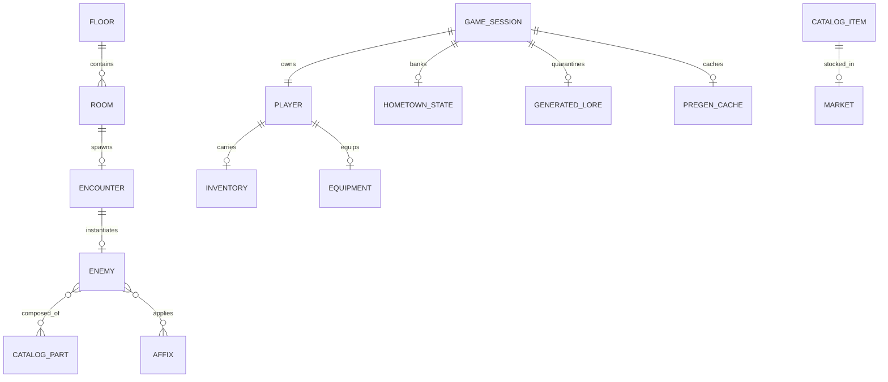

# Data model

> Status: **skeleton** — seeded in T1.1; full content lands across the waves (see `specs/tasks.md`). This file is covered by the `docs-check` drift gate.

ERD (D6) generated from the Pydantic models

> **Diagram legend** — `erDiagram` does not support `classDef` coloring; `GAME_SESSION` is the **root aggregate** (every per-session store — `HOMETOWN_STATE`, `GENERATED_LORE`, `PREGEN_CACHE` — hangs off it and is purged with it, retention cascade). Regenerated from `server/app/game/models.py` by `docs-check`.

## Diagrams

### D6 — Data model (ERD, regenerated from Pydantic models)

## See also

- [System design — single-write path](03-system-design.md)
- [Game states — FightState](04-game-states.md)

<!-- content to follow -->
