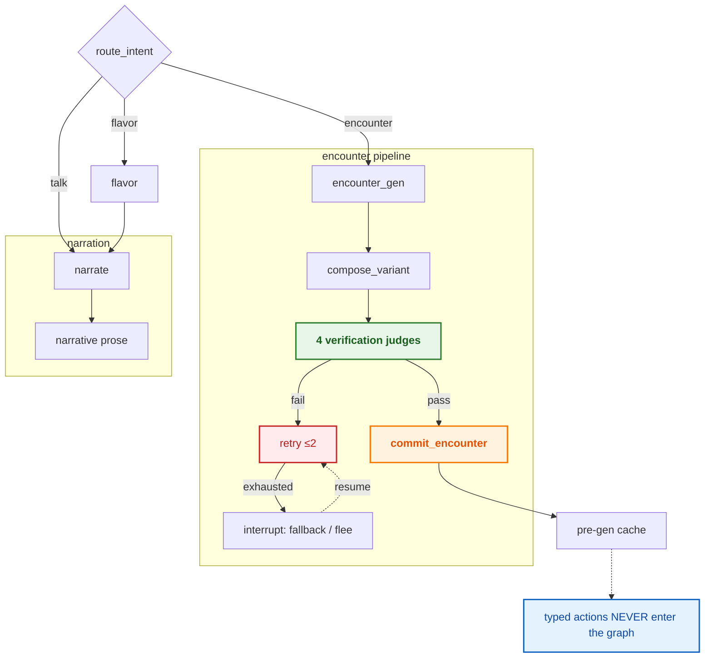
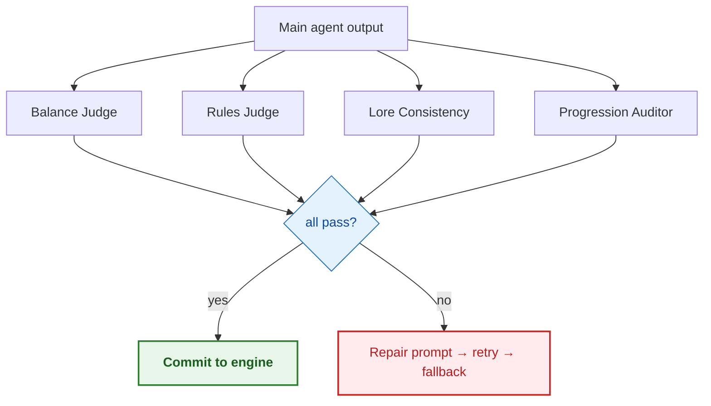

# Agent design

> Status: **complete** — LangGraph director graph (D4), tool layer, verification-agent loop (D9), LLM wired via OpenRouter.

> [!NOTE]
> The director's LLM calls route through `app/llm.py` (OpenRouter, OpenAI-compatible): `MODEL_FAST` (8B) for routing/judges, `MODEL_CHAT` (70B) for composition and narrative. The LLM only emits content — `enemy_id` + affixes — and the engine supplies stats from the catalog; every variant passes clamp + the four judges before `commit_encounter`.

LangGraph director graph (D4), tool layer, verification-agent loop (D9)

> **Diagram legend** — 🟠 critical/gate · 🟢 pass/success · 🔴 fail/fallback · 🔵 info

## Diagrams

### D4 — LangGraph dungeon-director graph

### D9 — Verification-agent loop

## See also

- [WS protocol — decision frames](05-protocol.md)
- [Content catalog — compose pipeline](08-content-catalog.md)
- [System design — commit_encounter](03-system-design.md)

