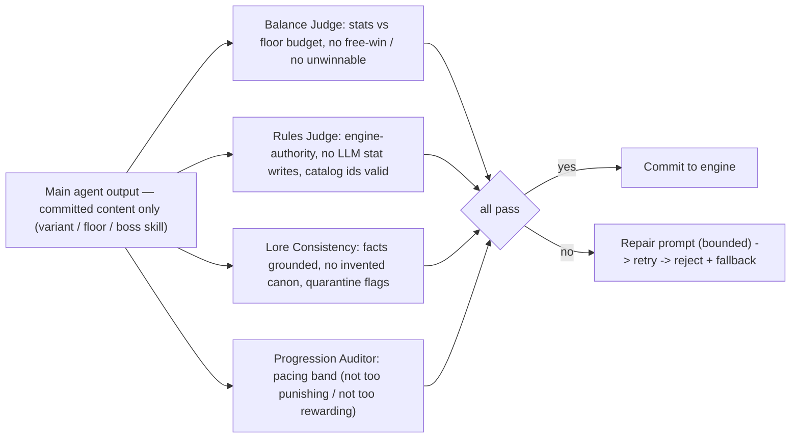

# Agent design

> Status: **skeleton** — seeded in T1.1; full content lands across the waves (see `specs/tasks.md`). This file is covered by the `docs:check` drift gate.

LangGraph director graph (D4), tool layer, verification-agent loop (D9)

## Diagrams

### D4 — LangGraph dungeon-director graph

```mermaid
flowchart LR
  WD["wait_for_decision (interrupt)"] --> RI{"route_intent"}
  RI -->|floor progress| FG["floor_gen subgraph"]
  RI -->|encounter| EG["encounter_gen subgraph"]
  RI -->|boss| BG["boss_gen subgraph"]
  RI -->|talk / free-form| NA["narrate"]
  RI -->|flavor| FL["rest / market / shrine flavor"]
  FG --> CV["compose_variant (RAG + schema + clamps)"]
  EG --> CV
  BG --> CV
  CV --> VA["verification agents (balance, rules, lore, progression)"]
  VA -->|pass| CE["commit_encounter — single write path"]
  VA -->|fail| FB["repair retry (<=2) / fallback"]
  FB --> CE
  CE --> CACHE["pre-gen cache (session LRU, content_version, TTL)"]
  NA --> WD
  FL --> WD
  note right of WD: typed actions NEVER enter the graph; busy covers graph-routed actions only
```

### D9 — Verification-agent loop



<!-- content to follow -->