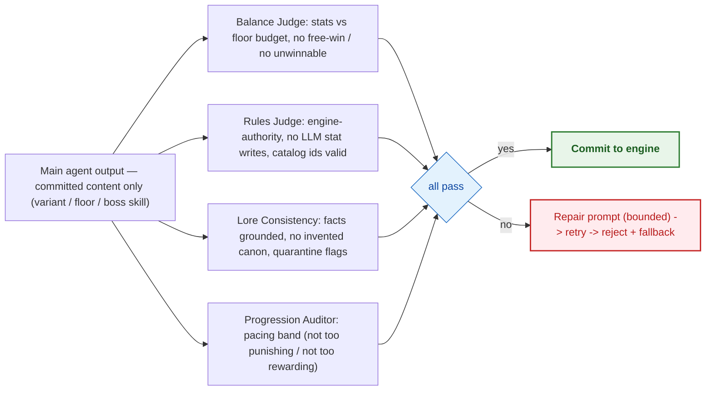

# Agent design

> Status: **skeleton** — seeded in T1.1; full content lands across the waves (see `specs/tasks.md`). This file is covered by the `docs-check` drift gate.

LangGraph director graph (D4), tool layer, verification-agent loop (D9)

> **Diagram legend** — 🟠 critical/gate · 🟢 pass/success · 🔴 fail/fallback · 🔵 info

## Diagrams

### D4 — LangGraph dungeon-director graph

```mermaid
flowchart LR
  classDef crit fill:#FFF3E0,stroke:#F57C00,stroke-width:2px,color:#E65100,font-weight:bold
  classDef ok   fill:#E8F5E9,stroke:#2E7D32,stroke-width:2px,color:#1B5E20,font-weight:bold
  classDef bad  fill:#FFEBEE,stroke:#C62828,stroke-width:2px,color:#B71C1C
  classDef info fill:#E3F2FD,stroke:#1565C0,stroke-width:2px,color:#0D47A1

  WD["wait_for_decision (interrupt)"] --> RI{"route_intent"}
  RI -->|floor progress| FG["floor_gen subgraph"]
  RI -->|encounter| EG["encounter_gen subgraph"]
  RI -->|boss| BG["boss_gen subgraph"]
  RI -->|talk / free-form| NA["narrate"]
  RI -->|flavor| FL["rest / market / shrine flavor"]
  FG --> CV["compose_variant (RAG + schema + clamps)"]
  EG --> CV
  BG --> CV
  CV --> VA["verification agents (balance, rules, lore, progression)"]:::ok
  VA -->|pass| CE["commit_encounter — single write path"]:::crit
  VA -->|fail| FB["repair retry (<=2) / fallback"]:::bad
  FB --> CE
  CE --> CACHE["pre-gen cache (session LRU, content_version, TTL)"]
  NA --> WD
  FL --> WD
  note right of WD: typed actions NEVER enter the graph; busy covers graph-routed actions only
```

### D9 — Verification-agent loop



## See also

- [WS protocol — decision frames](05-protocol.md)
- [Content catalog — compose pipeline](08-content-catalog.md)
- [System design — commit_encounter](03-system-design.md)

<!-- content to follow -->
