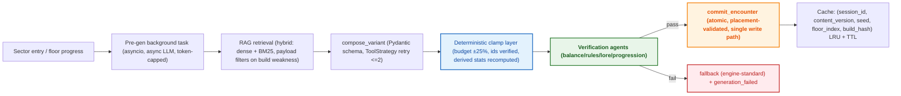
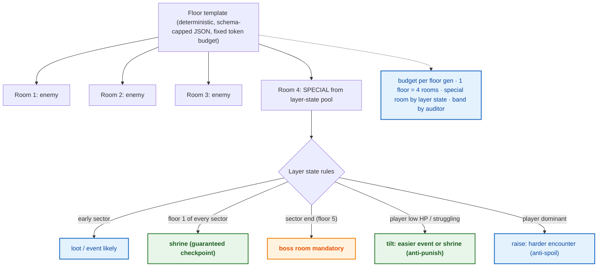

# Content catalog

> Status: **complete** — catalog schema, RAG retrieval, variant composition + clamps, floor template & pacing (D10), token budget, content pipeline (D8).

Catalog schema, RAG retrieval, variant composition + clamps, floor template & pacing (D10), token budget, content pipeline (D8)

> **Diagram legend** — 🟠 critical/gate · 🟢 pass/success · 🔴 fail/fallback · 🔵 info

## Diagrams

### D8 — Content pipeline: pre-gen → compose → clamp → verify → commit

### D10 — Floor template & pacing (token budget constraint)

## Retrieval scale-out path

> [!NOTE]
> Retrieval runs **local single-process**: Cohere dense embeddings + BM25, fused with RRF, filtered by payload. Document vectors are cached in memory per catalog version.

> [!TIP]
> Flip to Qdrant (docker compose) when any of these hold: the corpus outgrows comfortable memory (~10k+ records), vectors must persist across restarts, or multiple server processes need shared search. The seam is `Retriever.retrieve()` — swap its body for a Qdrant query; BM25 stays as the fallback half.

## See also

- [AI RAG corpus — sources & licensing](09-ai-rag-corpus.md)
- [Agent design — verifier loop](07-agent-design.md)
- [Specification — FR-3 / FR-6](../specs/spec.md#4-functional-requirements)

