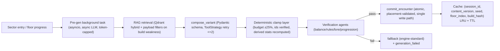

# Content catalog

> Status: **skeleton** — seeded in T1.1; full content lands across the waves (see `specs/tasks.md`). This file is covered by the `docs:check` drift gate.

Catalog schema, RAG retrieval, variant composition + clamps, floor template & pacing (D10), token budget, content pipeline (D8)

## Diagrams

### D8 — Content pipeline: pre-gen → compose → clamp → verify → commit



### D10 — Floor template & pacing (token budget constraint)

```mermaid
flowchart TD
  T["Floor template (deterministic, schema-capped JSON, fixed token budget)"] --> R1["Room 1: enemy"]
  T --> R2["Room 2: enemy"]
  T --> R3["Room 3: enemy"]
  T --> R4["Room 4: SPECIAL from layer-state pool"]
  R4 --> P{"Layer state rules"}
  P -->|early sector| A["loot / event likely"]
  P -->|floor 1 of every sector| B["shrine (guaranteed checkpoint)"]
  P -->|sector end (floor 5)| C["boss room mandatory"]
  P -->|player low HP / struggling| D["tilt: easier event or shrine (anti-punish)"]
  P -->|player dominant| E["raise: harder encounter (anti-spoil)"]
  note right of T: budget per floor gen; 1 floor = 4 rooms; special room picked by layer state; difficulty band enforced by Progression Auditor
```

<!-- content to follow -->