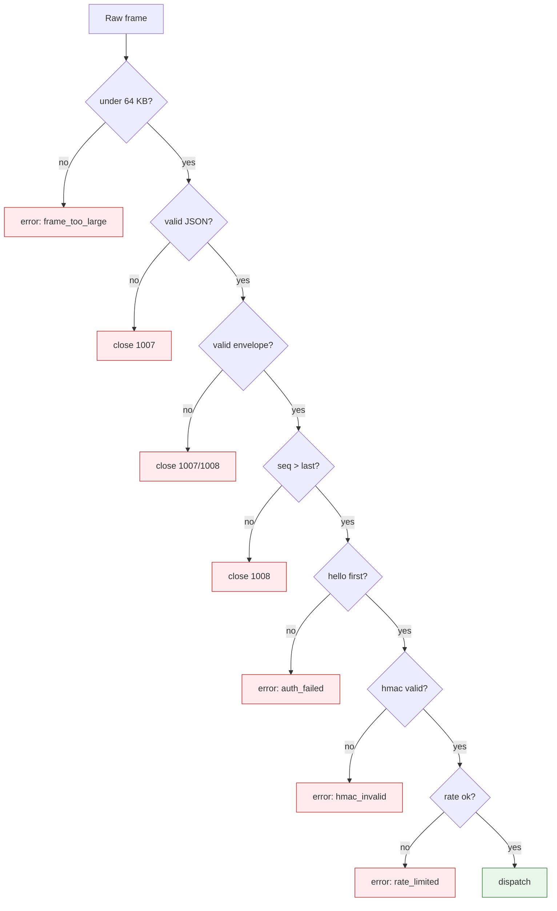

# Security

> [!IMPORTANT]
> The engine owns **all** stats, combat, and enemy AI. No client-trusted value is ever accepted: every gameplay value is either deterministic (re-simmed from the input log) or server-validated. A hacked client cannot lie about results.

## Threat model

> [!NOTE]
> Posture is **A-now / B-ready**. The single-player loop runs fully server-authoritative today (A); the B-flip (LLM narration, cross-session features) sits behind the same envelope, so no trust boundary moves when it lands.

> **Diagram legend** — 🟢 dispatch (valid) · 🔴 rejection (typed error / clean close)

## Envelope hardening (T5.4)

> [!TIP]
> Every frame passes, in order: 64 KB size cap → JSON parse → envelope schema → strict per-direction seq (anti-replay) → `hello`-first auth → HMAC (post-welcome) → per-session token-bucket rate limit. Rejection is always a typed `error` code or a clean `1007`/`1008` close — never a crash.

- **HMAC** — every post-welcome frame is signed with a per-session 32-byte key; a mismatch returns `hmac_invalid` (recoverable) without dropping the connection.
- **Schema** — `validate_envelope` + `validate_payload` reject malformed/unknown frames.
- **Anti-replay** — `SeqTracker` rejects any `seq <= last_seen` with a `1008` close.
- **Rate limit** — `TokenBucket` (50 msg/s, burst 100) returns `rate_limited`.

## Telemetry hook

> [!NOTE]
> Every rejected frame routes through `log_security_event(code, detail)` — a single structured log point (logger `heirs-of-the-abyss.security`) covering auth failure, HMAC mismatch, seq replay, rate-limit hit, oversized frame, and malformed JSON. Operators alert on this one logger; no per-branch instrumentation is needed.

## Client audit (T6.3)

> [!TIP]
> Audited the client for content-of-trust violations: the only `randi()` is a message correlation ID (not gameplay), and all `FileAccess` is in the test harness. No client save file, no client-trusted value — invariants #3 (determinism) and #6 (no client save) hold.

## Transport (WSS/TLS)

> [!NOTE]
> The gateway is plain WS in local dev. Production **must** terminate TLS and use `wss://` — the HMAC key and resume token are bearer secrets and are only safe in transit under TLS.

> [!CAUTION]
> Never ship with the default `DEV_TOKEN` (`dev-secret-change-me`); set `DEV_TOKEN` and enforce TLS in production. A resume token captured on a plaintext channel lets an attacker resume the session.

## See also

- [WS protocol — HMAC / seq / rate-limit](05-protocol.md)
- [System architecture — B-ready flip](02-architecture.md)
- [Specification — NFR-5 / NFR-6](../specs/spec.md#5-non-functional-requirements)
- [Runbook — production transport](10-runbook.md)
